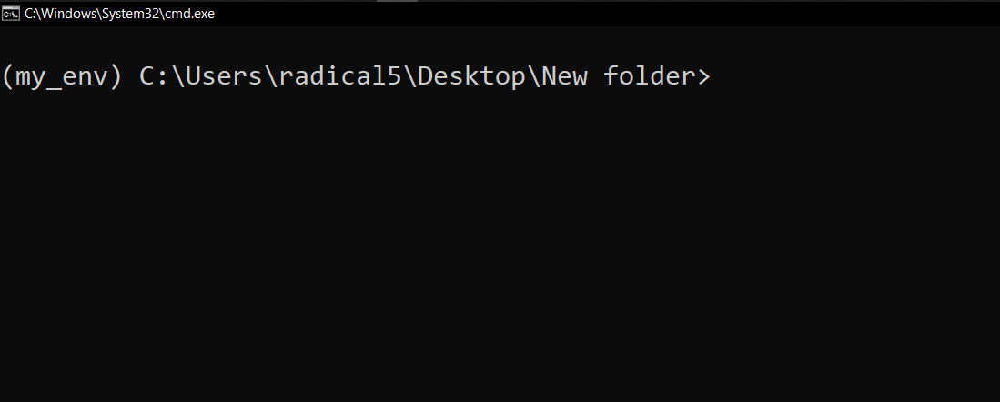

# University Project With Django And React

This project consists of four team members overall devided into two teams of two in frontend and backend.
We will use Django to provide apis for reaching out to business logic and database and also use reactjs library for client side.
In Bellow and up comming parts of this readme file you will find pre requests to run projects in client and server side ,
All models , use cases and methods used in project.

## Prerequisites

- Node.js (version X.X.X)
- Npm (version X.X.X)
- Django (version Y.Y.Y)

# Getting Started

## Preparing the backend side
a)  Clone the repository
```shell
git clone  https://github.com/pooya-dehghan/educational_ministry_irp
```

b) Navigate to the project directory:
```shell
cd educational_ministry_irp
```
c) Create a virtual environment to isolate project dependencies locally

```shell
python -m venv <name of your virtualenv>
example:
python -m venv my_env
```
- we can install virtualenv package to create it too. use this command

```shell
python -m pip install virtualenv
```
- after installing virtualenv use this command for creating your virtual environment

```shell
virtualenv <name of your environment>
example:
virtualenv my_env
```
d) activate your virtual environment
- windows
```shell
<name of your environment>\Scripts\activate
example:
my_env\Scripts\activate
```
- linux:
```shell
source <name of your environment>/bin/activate
example:
source my_env/bin/activate
```

## After activating the virtual environment you should see the name of your environment behind the path of your application. like the below image:



e) Install the dependencies(Backend side)
- notice that your virtual environment should be active while installing
- using backend_requirments.txt file in the repo:
```shell
pip install -r backend_requirments.txt
```


f) navigate to the backend folder(directory)
```shell
cd backend
```

g) now you can run the backend server with this command:

```shell
python manage.py runserver
```

- you should see a message in your command line or terminal like this:


h) If you want to see the output, open the browser and search for this address
```shell
http://localhost:8000
or
http://127.0.0.1:8000
```

# migrate
you have more than 20 unapplied migrations. so you can not use the admin panel or database. 
- this command applies all unapplied migrations.
```shell
python manage.py migrate
```

# superuser
- To access the admin panel to manage users and materials, create a superuser:

```shell
python manage.py createsuperuser
```
- Follow the prompts to enter your desired username, email, and password.

- Go to http://localhost:8000/admin/ ↗ and log in with your superuser credentials.

# Backend Views
As a back-end developer, here are some of the key views and endpoints that you'll want to be aware of:

- school/api/v1/list/: This endpoint returns a list of all schools in the system.
- school/api/v1/<int:pk>/: This endpoint use for create update and delete a school in the system.
- student/api/v1/list/: This endpoint returns a list of all students in the system.
- student/api/v1/<int:pk>/: This endpoint use for create update and delete a student in the system.
- accounts/api/v1/registration/: endpoint for user registration.


- accounts/api/v1/jwt/create/ endpoint is typically used for creating access and refresh token
- /accounts/api/v1/jwt/refresh/ endpoint is used for refreshing user access tokens
- accounts/api/v1/jwt/verify/ endpoint is used for validating user tokens.
- accounts/api/v1/login/ : this endpoint is for login :))))

# Install the dependencies(client side):


```shell
cd educational_ministry_irp
npm install
```


```shell
XXXXXXXXXXXXXXXXXXXXXXXXXXXXXXXXXXXXXX
XXXXXXXXXXXXXXXXXXXXXXXXXXXXXXXXXXXXXX
```

Access the API at http://localhost:XXXX/XXXX/XXXX

## Authentication

This API uses token-based authentication. To access protected endpoints, include an Authorization header in your requests with the value `Bearer YOUR_TOKEN`.

## Features

**User Authentication:**

- User registration
- User login
- User logout
- Password reset/forgot password

**User: All kind of user Profile:**

- Retrieve user profile
- Update user profile (name, bio, profile picture)
- user requesting to specific Office Manager or some other user for specific roles
- Getting notifications
- making notification for specific user
- read/seen notifications
- Deleting Profile
- Updating Profile
- 
**Notifications:**

- List profile template


**Direct Messaging:**

- Send a direct message to a user
- Retrieve direct message conversations
- Mark messages as read
- Get message numbers as didnt read yet
- Message Restrictions for user (user with access student wont be able to message organizations)

## Models

```typescript
interface User {
id : number
organization : Organization
messagesSent : Message[]
messagesRecieved : Message[]
role : string
tasks : Task[]
status : string
notifications : Notification[]
alerts : Alert[]
firstname : string
lastname : string
username : string
phonenumber : string
email : string
bio : string
school : School
manager Manager
}
```

```typescript
interface Organization : {
id : number
name : string
role : string
phonenumbers : string[]
manager : Manager
students : Student[]
schools : School[]
}
```

```typescript
interface School : {
  id : number
  name : string
  phonenumbers : string[]
  dstrict : number
  city : City
  students : Student[]
  manager  : Manager
  organization : Organization
}
```

```typescript
interface Student  : {
  id  : number
  name : string
  phonenumber : string
  role : string
  city : City
  school  : School
  organization : Organization
  tasks : Task[]
  alerts : Alert[]
  notifications: Notification[]
}
```

```typescript
interface Manager {
  id: number;
  firstname: string;
  lastname: string;
  school: School;
  phonenumbers: string[];
  organization: Organization;
  tasks: Task[];
  alerts: Alert[];
  notifications: Notification[];
}
```

```typescript
interface Notification {
  id: number;
  title: string;
  body: string;
  notification_token: string;
  device_type: string;
  picture_url: string;
}
```

```typescript
interface Alert {
  id : number
  title : string
  body : string
  type : string #(success ,warning , error , info)
  read : boolean
}
```

```typescript
interface Message {
  id: number;
  message: string;
  sender: User;
  reciever: User;
  read: boolean;
}
```

```typescript
interface Task {
  id : number
  user : User
  title : string
  description : string
  dueTime : Time
  createdTime : Time
  giver : User
  status : string #(done , in_progress , draft)
}
```

```typescript
interface City : {
  id : number
  name : string
  countery : string
  districts : number[]
}
```

## API Routes

| Route                       | Method | Description                                                                          |
| --------------------------- | ------ | ------------------------------------------------------------------------------------ |
| `/api/auth/signup`          | POST   | Register a new user account                                                          |
| `/api/auth/login`           | POST   | Authenticate and log in a user                                                       |
| `/api/auth/logout`          | POST   | Log out the currently authenticated user                                             |
| `/api/users`                | GET    | Get all users (admin only)                                                           |
| `/api/users/:id`            | GET    | Get a specific user by ID                                                            |
| `/api/users/:id`            | PUT    | Update a specific user by ID                                                         |
| `/api/users/:id`            | DELETE | Delete a specific user by ID                                                         |
| `/api/task/:userId/giverId` | Post   | create a new task for user                                                           |
| `/api/task/:userId`         | GET    | get all task for a user by ID                                                        |
| `/api/task/:taskId`         | DELETE | Delete a specific task by ID                                                         |
| `/api/task/:taskId`         | GET    | Get a task informationa and state by ID                                              |
| `/api/task/:taskId`         | PUT    | Update a task by ID                                                                  |
| `/api/task/:giverId`        | GET    | Get all tasks a user give and sent out                                               |
| `/api/organization`         | Post   | create a new organization                                                            |
| `/api/organization`         | GET    | get all organization                                                                 |
| `/api/organization/:id`     | PUT    | update a organization by ID                                                          |
| `/api/organization/:id`     | GET    | Get a organization informationa and state by ID                                      |
| `/api/notification/:userId` | POST   | creating sending a notification to a specific user by id and title and body provided |

This table provides an overview of the routes available in the Project System API, along with their associated HTTP methods and descriptions. Please note that this is just a sample and you may have additional routes or modify the existing ones based on your specific project requirements.

## Examples

## Contributing

Contributions are welcome! If you find any issues or would like to add new features, feel free to open a pull request.

## License

This project is licensed under the GPL-3.0 License.

Copyright 2023, Pooya Dehghan
